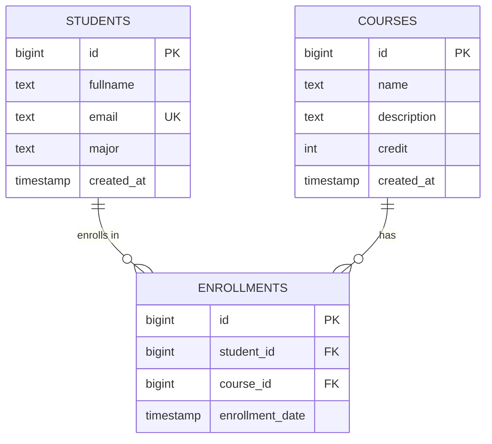
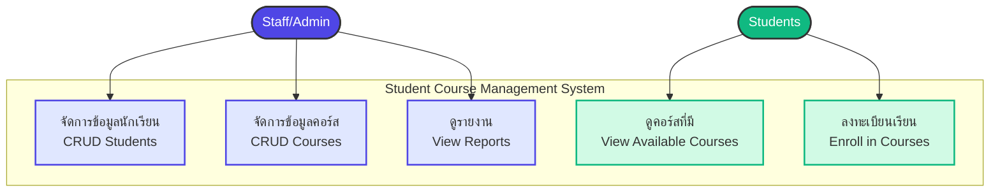

<div align="center">

# 🎓 Student Course Management System API

### ระบบจัดการนักเรียนและคอร์สเรียน

[](https://github.com/Petchzz02/-Students-_Courese_System)
[](LICENSE)
[](https://nodejs.org/)
[](https://expressjs.com/)
[](https://supabase.com/)

**RESTful API ที่พัฒนาด้วย Node.js, Express และ Supabase สำหรับจัดการข้อมูลนักเรียน คอร์สเรียน และการลงทะเบียนเรียน**

[🚀 Live Demo](https://students-courese-system.onrender.com) • [📖 Documentation](#-api-endpoints) • [🐛 Report Bug](https://github.com/Petchzz02/-Students-_Courese_System/issues)

</div>

---

---

## 🌟 คุณสมบัติของระบบ (Features)

<table>
<tr>
<td width="50%">

### 👨‍🎓 จัดการนักเรียน (Students)
- ✅ สร้างข้อมูลนักเรียนใหม่
- ✅ ดูรายชื่อนักเรียนทั้งหมด
- ✅ ค้นหานักเรียนตาม ID
- ✅ แก้ไขข้อมูลนักเรียน
- ✅ ลบข้อมูลนักเรียน

</td>
<td width="50%">

### 📚 จัดการคอร์สเรียน (Courses)
- ✅ สร้างคอร์สเรียนใหม่
- ✅ ดูรายการคอร์สทั้งหมด
- ✅ ค้นหาคอร์สตาม ID
- ✅ แก้ไขข้อมูลคอร์ส
- ✅ ลบคอร์สเรียน

</td>
</tr>
<tr>
<td width="50%">

### ✏️ การลงทะเบียน (Enrollments)
- ✅ ลงทะเบียนนักเรียนเข้าคอร์ส
- ✅ ดูประวัติการลงทะเบียนทั้งหมด
- ✅ ยกเลิกการลงทะเบียน
- ✅ ตรวจสอบการลงทะเบียนซ้ำ

</td>
<td width="50%">

### 🗄️ Database & Backend
- ✅ เชื่อมต่อ Supabase (PostgreSQL)
- ✅ RESTful API Design
- ✅ Error Handling
- ✅ CORS Support

</td>
</tr>
</table>

---

## 🛠 เทคโนโลยีที่ใช้ (Tech Stack)

<div align="center">

| Technology | Description | Version |
|:----------:|:------------|:-------:|
|  | JavaScript Runtime | 16+ |
|  | Web Framework | 5.1.0 |
|  | Database (PostgreSQL) | Latest |
|  | Development Tool | 3.1.11 |
|  | Environment Variables | 17.2.3 |

</div>

---

## 📊 System Design

### 🗂️ ER Diagram (Entity Relationship Diagram)

แผนภาพแสดงความสัมพันธ์ของฐานข้อมูล:

<div align="center">



</div>

**คำอธิบาย:**
- **Students (นักเรียน):** เก็บข้อมูลนักเรียน มี ID, ชื่อ-นามสกุล, อีเมล, สาขา
- **Courses (คอร์สเรียน):** เก็บข้อมูลคอร์ส มี ID, ชื่อวิชา, รายละเอียด, หน่วยกิต
- **Enrollments (การลงทะเบียน):** เชื่อมโยง Students กับ Courses แสดงการลงทะเบียนเรียน
- **ความสัมพันธ์:** 
  - นักเรียน 1 คน สามารถลงทะเบียนได้หลายคอร์ส (1:N)
  - คอร์ส 1 วิชา สามารถมีนักเรียนได้หลายคน (1:N)
  - ความสัมพันธ์แบบ Many-to-Many ผ่านตาราง Enrollments

---

### 👥 Use Case Diagram

แผนภาพแสดงการใช้งานระบบของผู้ใช้แต่ละประเภท:

<div align="center">



</div>

**ผู้ใช้งานระบบ (Actors):**

1. **👨‍💼 Staff/Admin** - เจ้าหน้าที่/ผู้ดูแลระบบ
   - จัดการข้อมูลนักเรียน (เพิ่ม แก้ไข ลบ)
   - จัดการข้อมูลคอร์ส (เพิ่ม แก้ไข ลบ)
   - ดูรายงานสถิติต่างๆ
   - จัดการการลงทะเบียนของนักเรียน

2. **👨‍🎓 Students** - นักเรียน
   - ดูรายการคอร์สที่เปิดสอน
   - ลงทะเบียนเรียนในคอร์สที่สนใจ
   - ดูคอร์สที่ตนเองลงทะเบียนไว้

**Use Cases:**

| Use Case | Actor | Description |
|----------|-------|-------------|
| **Manage Students (CRUD)** | Staff | จัดการข้อมูลนักเรียนทั้งหมด สร้าง อ่าน แก้ไข ลบ |
| **Manage Courses (CRUD)** | Staff | จัดการข้อมูลคอร์สเรียน เพิ่มวิชาใหม่ แก้ไข ลบ |
| **View Reports** | Staff | ดูรายงานสถิติ เช่น จำนวนนักเรียน จำนวนคอร์ส การลงทะเบียน |
| **View Own Courses** | Students | นักเรียนดูคอร์สที่ตนเองลงทะเบียนไว้ |
| **Enroll** | Students | ลงทะเบียนเรียนในคอร์สที่สนใจ |

---

## 🗄️ Database Schema

### ตาราง students

| Column | Type | Description | Constraints |
|--------|------|-------------|-------------|
| `id` | BIGINT | รหัสนักเรียน | PRIMARY KEY, AUTO_INCREMENT |
| `fullname` | TEXT | ชื่อ-นามสกุล | NOT NULL |
| `email` | TEXT | อีเมล | NOT NULL, UNIQUE |
| `major` | TEXT | สาขาวิชา | - |
| `created_at` | TIMESTAMP | วันที่สร้างข้อมูล | DEFAULT NOW() |

### ตาราง courses

| Column | Type | Description | Constraints |
|--------|------|-------------|-------------|
| `id` | BIGINT | รหัสวิชา | PRIMARY KEY, AUTO_INCREMENT |
| `name` | TEXT | ชื่อวิชา | NOT NULL |
| `description` | TEXT | รายละเอียดวิชา | - |
| `credit` | INT | หน่วยกิต | NOT NULL |
| `created_at` | TIMESTAMP | วันที่สร้างข้อมูล | DEFAULT NOW() |

### ตาราง enrollments

| Column | Type | Description | Constraints |
|--------|------|-------------|-------------|
| `id` | BIGINT | รหัสการลงทะเบียน | PRIMARY KEY, AUTO_INCREMENT |
| `student_id` | BIGINT | รหัสนักเรียน | FOREIGN KEY → students(id), ON DELETE CASCADE |
| `course_id` | BIGINT | รหัสวิชา | FOREIGN KEY → courses(id), ON DELETE CASCADE |
| `enrollment_date` | TIMESTAMP | วันที่ลงทะเบียน | DEFAULT NOW() |

**ข้อจำกัด (Constraints):**
- `student_id` + `course_id` → UNIQUE (ป้องกันการลงทะเบียนซ้ำ)
- ON DELETE CASCADE → เมื่อลบนักเรียนหรือคอร์ส จะลบการลงทะเบียนที่เกี่ยวข้องด้วย

---

## ⚙️ การติดตั้งและรันระบบ (Installation)

### 📋 ความต้องการของระบบ (Prerequisites)

ก่อนเริ่มต้น ตรวจสอบให้แน่ใจว่าคุณได้ติดตั้งโปรแกรมต่อไปนี้:

- ✅ **Node.js** (เวอร์ชัน 14.0 ขึ้นไป) - [ดาวน์โหลด](https://nodejs.org/)
- ✅ **npm** (มาพร้อมกับ Node.js)
- ✅ **Git** - [ดาวน์โหลด](https://git-scm.com/)
- ✅ **Supabase Account** - [สมัครฟรี](https://supabase.com/)

### 🚀 ขั้นตอนการติดตั้ง

#### 1️⃣ Clone Repository

```bash
git clone https://github.com/Petchzz02/-Students-_Courese_System.git
cd -Students-_Courese_System
```

#### 2️⃣ ติดตั้ง Dependencies

```bash
npm install
```

#### 3️⃣ ตั้งค่า Environment Variables

สร้างไฟล์ `.env` ในโฟลเดอร์หลัก:

```env
SUPABASE_URL=your_supabase_url
SUPABASE_KEY=your_supabase_anon_key
PORT=3000
```

> 💡 **วิธีหา Supabase Credentials:**
> 1. เข้าสู่ระบบ [Supabase Dashboard](https://app.supabase.com/)
> 2. เลือกโปรเจคของคุณ
> 3. ไปที่ **Settings** → **API**
> 4. คัดลอก **URL** และ **anon/public key**

#### 4️⃣ สร้างตารางใน Supabase

รันคำสั่ง SQL นี้ใน **SQL Editor** ของ Supabase:

```sql
-- 1. ตาราง Students
CREATE TABLE students (
  id BIGINT GENERATED BY DEFAULT AS IDENTITY PRIMARY KEY,
  fullname TEXT NOT NULL,
  email TEXT UNIQUE NOT NULL,
  major TEXT,
  created_at TIMESTAMP WITH TIME ZONE DEFAULT TIMEZONE('utc', NOW())
);

-- 2. ตาราง Courses
CREATE TABLE courses (
  id BIGINT GENERATED BY DEFAULT AS IDENTITY PRIMARY KEY,
  name TEXT NOT NULL,
  description TEXT,
  credit INT NOT NULL,
  created_at TIMESTAMP WITH TIME ZONE DEFAULT TIMEZONE('utc', NOW())
);

-- 3. ตาราง Enrollments
CREATE TABLE enrollments (
  id BIGINT GENERATED BY DEFAULT AS IDENTITY PRIMARY KEY,
  student_id BIGINT REFERENCES students(id) ON DELETE CASCADE,
  course_id BIGINT REFERENCES courses(id) ON DELETE CASCADE,
  enrollment_date TIMESTAMP WITH TIME ZONE DEFAULT TIMEZONE('utc', NOW())
);
```

#### 5️⃣ รันเซิร์ฟเวอร์

```bash
# Development Mode (Auto-reload with Nodemon)
npm run dev

# Production Mode
npm start
```

✅ **Server กำลังทำงานที่:** `http://localhost:3000`

> 🌐 เปิด browser ที่ `http://localhost:3000` เพื่อดูหน้า API Documentation

---

## 🎨 Frontend Interface

ระบบมาพร้อมกับ Web Interface ที่สวยงามและใช้งานง่าย!

### ✨ คุณสมบัติของ Frontend

- **📱 Responsive Design** - รองรับทุกขนาดหน้าจอ
- **🎯 User-Friendly Interface** - ใช้งานง่าย เข้าใจได้ทันที
- **⚡ Real-time Updates** - อัพเดทข้อมูลแบบ real-time
- **🔍 Search Functionality** - ค้นหาข้อมูลได้ทุกหมวด
- **✅ Form Validation** - ตรวจสอบข้อมูลก่อนส่ง
- **🎨 Modern UI/UX** - ออกแบบสวยงาม ใช้สีสันสบายตา

### 📄 หน้าเว็บที่มี

1. **หน้าจัดการนักเรียน** - เพิ่ม แก้ไข ลบ และค้นหานักเรียน
2. **หน้าจัดการคอร์ส** - เพิ่ม แก้ไข ลบ และค้นหาคอร์สเรียน
3. **หน้าจัดการการลงทะเบียน** - ลงทะเบียนและยกเลิกการลงทะเบียน

### 🚀 วิธีเข้าใช้งาน

เมื่อ server รันแล้ว เปิด browser ที่:

```
http://localhost:3000
```

จะเห็นหน้า Web Interface พร้อมใช้งานทันที!

### 📸 Preview

- **Navigation Bar** - สลับระหว่างหน้าต่างๆ ง่ายๆ
- **Data Tables** - แสดงข้อมูลในรูปแบบตาราง
- **Modal Forms** - ฟอร์มเพิ่ม/แก้ไขข้อมูลแบบ popup
- **Toast Notifications** - แจ้งเตือนสถานะการทำงาน
---

## 📡 API Endpoints

### 🏠 Root Endpoint

```http
GET /
```

แสดงหน้า API Documentation พร้อมรายการ endpoints ทั้งหมด

---

### 1️⃣ Students (นักเรียน)

<details>
<summary>📖 คลิกเพื่อดู API สำหรับนักเรียน</summary>

| Method | Endpoint | Description | Request Body |
|--------|----------|-------------|--------------|
| `GET` | `/api/students` | ดึงข้อมูลนักเรียนทั้งหมด | - |
| `GET` | `/api/students/:id` | ดึงข้อมูลนักเรียนตาม ID | - |
| `POST` | `/api/students` | เพิ่มนักเรียนใหม่ | `{ "fullname": "string", "email": "string", "major": "string" }` |
| `PUT` | `/api/students/:id` | แก้ไขข้อมูลนักเรียน | `{ "fullname": "string", "major": "string" }` |
| `DELETE` | `/api/students/:id` | ลบข้อมูลนักเรียน | - |

#### ตัวอย่างการใช้งาน

```javascript
// GET - ดึงนักเรียนทั้งหมด
fetch('http://localhost:3000/api/students')
  .then(res => res.json())
  .then(data => console.log(data));

// POST - เพิ่มนักเรียนใหม่
fetch('http://localhost:3000/api/students', {
  method: 'POST',
  headers: { 'Content-Type': 'application/json' },
  body: JSON.stringify({
    fullname: "John Doe",
    email: "john@email.com",
    major: "IT"
  })
});
```

</details>

---

### 2️⃣ Courses (วิชาเรียน)

<details>
<summary>📖 คลิกเพื่อดู API สำหรับคอร์สเรียน</summary>

| Method | Endpoint | Description | Request Body |
|--------|----------|-------------|--------------|
| `GET` | `/api/courses` | ดึงรายวิชาทั้งหมด | - |
| `GET` | `/api/courses/:id` | ดึงข้อมูลคอร์สตาม ID | - |
| `POST` | `/api/courses` | เพิ่มวิชาเรียนใหม่ | `{ "name": "string", "description": "string", "credit": number }` |
| `PUT` | `/api/courses/:id` | แก้ไขข้อมูลคอร์ส | `{ "name": "string", "description": "string", "credit": number }` |
| `DELETE` | `/api/courses/:id` | ลบคอร์สเรียน | - |

#### ตัวอย่างการใช้งาน

```javascript
// POST - เพิ่มคอร์สใหม่
fetch('http://localhost:3000/api/courses', {
  method: 'POST',
  headers: { 'Content-Type': 'application/json' },
  body: JSON.stringify({
    name: "Basic Node.js",
    description: "Backend Development",
    credit: 3
  })
});
```

</details>

---

### 3️⃣ Enrollments (การลงทะเบียน)

<details>
<summary>📖 คลิกเพื่อดู API สำหรับการลงทะเบียน</summary>

| Method | Endpoint | Description | Request Body |
|--------|----------|-------------|--------------|
| `GET` | `/api/enrollments` | ดูประวัติการลงทะเบียนทั้งหมด | - |
| `GET` | `/api/enrollments/:id` | ดูการลงทะเบียนตาม ID | - |
| `POST` | `/api/enrollments` | ลงทะเบียนเรียน | `{ "student_id": number, "course_id": number }` |
| `DELETE` | `/api/enrollments/:id` | ยกเลิกการลงทะเบียน | - |

#### ตัวอย่างการใช้งาน

```javascript
// POST - ลงทะเบียนเรียน
fetch('http://localhost:3000/api/enrollments', {
  method: 'POST',
  headers: { 'Content-Type': 'application/json' },
  body: JSON.stringify({
    student_id: 1,
    course_id: 1
  })
});
```

</details>---

## 🧪 System Test Cases (เอกสารทดสอบระบบ)

### 📊 สรุปผลการทดสอบ API ผ่าน Postman

<details>
<summary><b>TC-01: การจัดการข้อมูลนักเรียน (Manage Students)</b></summary>

| Test ID | Scenario | Input | Expected Result | Status |
|---------|----------|-------|-----------------|--------|
| ST-01 | ดึงข้อมูลนักเรียนทั้งหมด | `GET /api/students` | Status 200 OK + JSON Array | ✅ Pass |
| ST-02 | เพิ่มนักเรียนใหม่ (สำเร็จ) | `POST /api/students`<br>`{"fullname":"Test User","email":"test@mail.com","major":"IT"}` | Status 201 Created | ✅ Pass |
| ST-03 | เพิ่มนักเรียน (ข้อมูลไม่ครบ) | `POST /api/students`<br>`{"email":"fail@mail.com"}` | Status 400 Bad Request | ✅ Pass |
| ST-04 | แก้ไขข้อมูลนักเรียน | `PUT /api/students/1`<br>`{"fullname":"Updated Name","major":"CS"}` | Status 200 OK + Updated Data | ✅ Pass |
| ST-05 | ลบนักเรียน | `DELETE /api/students/1` | Status 200 OK + Delete Message | ✅ Pass |

</details>

<details>
<summary><b>TC-02: การจัดการวิชาเรียน (Manage Courses)</b></summary>

| Test ID | Scenario | Input | Expected Result | Status |
|---------|----------|-------|-----------------|--------|
| CS-01 | ดึงรายวิชาทั้งหมด | `GET /api/courses` | Status 200 OK + JSON Array | ✅ Pass |
| CS-02 | เพิ่มวิชาเรียนใหม่ | `POST /api/courses`<br>`{"name":"Basic Node.js","description":"Intro to Backend","credit":3}` | Status 201 Created | ✅ Pass |

</details>

<details>
<summary><b>TC-03: การลงทะเบียนเรียน (Enrollments)</b></summary>

| Test ID | Scenario | Input | Expected Result | Status |
|---------|----------|-------|-----------------|--------|
| EN-01 | ลงทะเบียนเรียน (สำเร็จ) | `POST /api/enrollments`<br>`{"student_id":1,"course_id":1}` | Status 201 Created | ✅ Pass |
| EN-02 | ลงทะเบียน (รหัสนักเรียนผิด) | `POST /api/enrollments`<br>`{"student_id":9999,"course_id":1}` | Status 400 Bad Request | ✅ Pass |

</details>---

## 🚀 Deployment

<div align="center">

### 🌐 Live Demo

ระบบนี้ได้ Deploy บน **Render** แล้ว

[](https://students-courese-system.onrender.com)

**🔗 Live URL:** [https://students-courese-system.onrender.com](https://students-courese-system.onrender.com)

</div>

---

## 📂 โครงสร้างโปรเจค (Project Structure)

```
📦 -Students-_Courese_System
┣ 📂 public/                # Frontend files
┃ ┣ 📜 index.html          # Main HTML page
┃ ┣ 📜 style.css           # Styles
┃ ┗ 📜 script.js           # JavaScript logic
┣ 📂 routes/
┃ ┣ 📜 students.js         # Routes สำหรับจัดการนักเรียน
┃ ┣ 📜 courses.js          # Routes สำหรับจัดการคอร์ส
┃ ┗ 📜 enrollments.js      # Routes สำหรับจัดการการลงทะเบียน
┣ 📜 .env                  # Environment variables (ไม่ commit)
┣ 📜 .gitignore            # ไฟล์ที่ไม่ต้องการ track
┣ 📜 package.json          # Dependencies และ scripts
┣ 📜 server.js             # Entry point ของแอปพลิเคชัน
┗ 📜 README.md             # เอกสารนี้
```

---

## 🔧 การแก้ไขปัญหา (Troubleshooting)

<details>
<summary><b>❌ Cannot find module</b></summary>

**สาเหตุ:** Dependencies ยังไม่ได้ติดตั้ง

**วิธีแก้:**
```bash
npm install
```

</details>

<details>
<summary><b>❌ Port already in use</b></summary>

**สาเหตุ:** Port 3000 ถูกใช้งานอยู่

**วิธีแก้:**
1. เปลี่ยน PORT ในไฟล์ `.env`
```env
PORT=3001
```
2. หรือปิดโปรแกรมที่ใช้ port 3000

</details>

<details>
<summary><b>❌ Supabase connection error</b></summary>

**สาเหตุ:** การเชื่อมต่อ Supabase ผิดพลาด

**วิธีแก้:**
- ตรวจสอบ `SUPABASE_URL` และ `SUPABASE_KEY` ในไฟล์ `.env`
- ตรวจสอบว่าได้สร้างตารางในฐานข้อมูลแล้ว
- ตรวจสอบ Internet connection

</details>

---

## 🤝 การมีส่วนร่วม (Contributing)

เรายินดีรับ contributions จากทุกคน! 

1. 🍴 Fork โปรเจค
2. 🌿 สร้าง Feature Branch (`git checkout -b feature/AmazingFeature`)
3. 💾 Commit การเปลี่ยนแปลง (`git commit -m 'Add some AmazingFeature'`)
4. 📤 Push ไปยัง Branch (`git push origin feature/AmazingFeature`)
5. 🔃 เปิด Pull Request

---

## 📜 License

This project is licensed under the **ISC License**

---

<div align="center">

## 👨‍💻 ผู้พัฒนา (Developer)

**Petchzz02**

[](https://github.com/Petchzz02)
[](https://github.com/Petchzz02/-Students-_Courese_System)

---

### 📞 ติดต่อ (Contact)

หากมีคำถามหรือพบปัญหา กรุณา:

[](https://github.com/Petchzz02/-Students-_Courese_System/issues)

---

**Made with ❤️ by Petchzz02**

⭐ ถ้าชอบโปรเจคนี้ กด Star ให้หน่อยนะครับ!

</div>